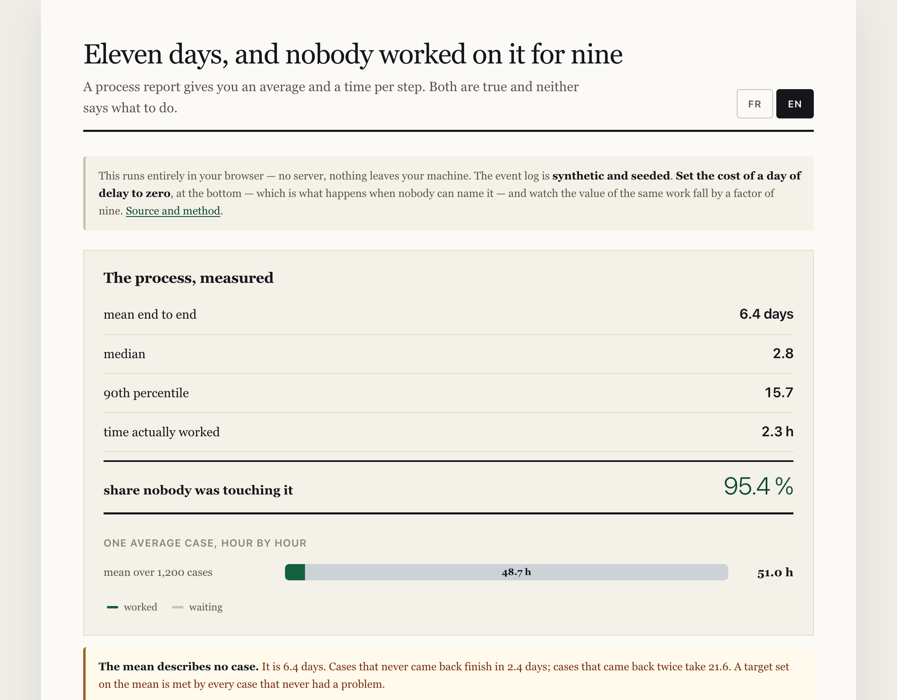

# Eleven days, and nobody worked on it for nine of them

An event log from a back-office process — case, activity, who, when — and the four questions
a process report cannot answer: did anybody follow the diagram, was anyone working, how many
times did each step happen, and which of the days are actually removable.

<!-- figures:finding -->
**The finding.** The process averages **6.4 working days** and no case in it takes 6.4 days. Cases that never came back finish in 2.4; cases that came back twice take 21.6. The mean sits between two populations and describes neither, and a target set on it is met by every case that never had a problem. Meanwhile somebody was actually working for **2.3 hours** of those 6.4 days — 95.4 % of the elapsed time, the file was sitting somewhere.
<!-- /figures:finding -->

**[Try it in your browser →](https://arslanesempai-ui.github.io/process-cycle-time/)** — the seventy-four routes cases actually take, against the one the process documents.



```bash
npm run paths        # the routes cases actually take, against the documented one
npm run time         # where the elapsed time went, and what a step average gets wrong
npm run rework       # the two populations hiding inside the average
npm run sensitivity  # which assumptions decide, and which only scale the answer
npm run adversarial  # five process reports where the obvious reading is wrong
npm run baselines    # against the proposals that need no analysis
npm test             # types, README figures, and 12 tests
```

Everything runs locally. No API key, nothing leaves the machine, and anyone who clones this
reproduces every number below.

---

## Did anybody follow the diagram?

<!-- figures:conformTable -->
The procedure describes one route:

`received → triaged → documents checked → risk assessed → approved`

**484 of 1,200 cases followed it exactly — 40.3 %** [37.6 % – 43.1 %]. There are **74 distinct routes**, and it takes **9** of them to cover four fifths of the cases.

| Cases | Share | Rework | Route |
|---|---|---|---|
| 484 | 40.3 % | 0 | `rec tri doc risk OK` ← **documented** |
| 120 | 10.0 % | 1 | `rec tri doc req doc risk OK` |
| 108 | 9.0 % | 0 | `rec doc risk OK` |
| 67 | 5.6 % | 1 | `rec tri doc req chase doc risk OK` |
| 63 | 5.3 % | 0 | `rec tri doc risk NO` |
| 58 | 4.8 % | 0 | `rec tri doc risk esc OK` |
| 32 | 2.7 % | 0 | `rec tri doc risk esc risk OK` |
| 26 | 2.2 % | 1 | `rec doc req doc risk OK` |

*66 further routes below these.*

Happens but is not in the procedure: `information requested`, `escalated`, `rejected`, `chased`.

Every documented step is observed at least once — the check exists because a control everybody believes is running, and which never runs, is the most expensive thing this analysis can find.
<!-- /figures:conformTable -->

This is conformance checking, and it needs no models and no statistics — only the event log
people already have and rarely look at. The uncomfortable direction is the usual one: the
documented route is a **minority**, and everything downstream inherits it. A training course
teaches the minority route, an automation is scoped to it, and a target is set on it.

---

## Where did the time go?

<!-- figures:timeTable -->
| Activity | Times per case | A report says | Actually costs per case | Median wait before |
|---|---|---|---|---|
| `risk assessed` | 1.05 | 56 min | **59 min** | 0.5 d |
| `documents checked` | 1.50 | 36 min | **54 min** | 0.7 d |
| `triaged` | 0.83 | 12 min | **10 min** | 0.5 d |
| `approved` | 0.89 | 6 min | **6 min** | 0.5 d |
| `information requested` | 0.50 | 8 min | **4 min** | 0.2 d |
| `escalated` | 0.14 | 26 min | **4 min** | 0.5 d |
| `received` | 1.00 | 2 min | **2 min** | 0.0 d |
| `chased` | 0.19 | 4 min | **1 min** | 5.1 d |
| `rejected` | 0.11 | 6 min | **1 min** | 0.5 d |
<!-- /figures:timeTable -->

<!-- figures:timeNote -->
A step average divides total minutes by **occurrences**, not by cases. `documents checked` happens 1.50 times per case because cases come back, so the two columns disagree — and no reporting tool computes the second one by default.

Here the slowest step and the costliest are both `risk assessed`, and the gap between the two columns has closed to 5 minutes. A slightly higher rework rate reverses it while the report never moves.

And every minute in both columns is dwarfed by the last one. The work is 4.6 % of the elapsed time.
<!-- /figures:timeNote -->

---

## The two populations inside the average

<!-- figures:cohortTable -->
|  | Cases | Share | Mean days | Median | Worked | vs a clean case |
|---|---|---|---|---|---|---|
| no rework | 781 | 65.1 % | **2.4** | 2.4 | 2.0 h | 1.0× |
| came back once | 293 | 24.4 % | **10.3** | 9.5 | 2.7 h | 4.2× |
| came back twice or more | 126 | 10.5 % | **21.6** | 20.4 | 3.8 h | 8.8× |
<!-- /figures:cohortTable -->

**No cohort is anywhere near the headline mean.** It is an average of populations that do not
overlap, and the two differ by a factor a report cannot show because the report has one row.

<!-- figures:reworkNote -->
419 cases went round the loop — **34.9 %** [32.3 % – 37.7 %] — and each spends an extra **11.3 working days** there.

Removing all of it takes the process from 6.4 days to 2.4, and returns $253,041 a year of analyst time.

That is an upper bound and is meant as one: some rework is a customer sending the wrong file, and no process change prevents that. What the figure is for is comparing against the cost of the change — which is the comparison nobody makes before starting.
<!-- /figures:reworkNote -->

---

## Which assumptions decide

<!-- figures:sensitivity -->
Removing all rework is worth **$2,181,639 a year** at the assumptions in use.

| Input | In use | At the low end | At the high end | Spread |
|---|---|---|---|---|
| `loadedHourlyCost` | 48 | $2,007,673 @ 15 | $3,510,103 @ 300 | 1.7× |
| `casesPerYear` | 14,000 | $77,916 @ 500 | $77,915,677 @ 500,000 | 1000.0× |
| `costPerDayOfDelay` | 35 | $253,041 @ 0 | $55,355,845 @ 1,000 | 218.8× |

With a day of delay priced at zero — which is what happens when nobody can name it — the same work is worth $253,041 rather than $2,181,639. **A factor of 8.6**, and the difference between a project that gets funded and one that does not.

An unpriced cost is not a cost of zero. Treating it as one is how process work loses to whatever happens to have a number attached to it.
<!-- /figures:sensitivity -->

---

## Five process reports where the obvious reading is wrong

Every number in these is arithmetically correct. Each supports a conclusion the event log
contradicts, and each is the ordinary output of a real reporting tool.

<!-- figures:traps -->
### The average describes no case in the process

**Appears to say.** We average six working days end to end. Set the target at five and push the team.

**Actually.** Two populations, not one. Cases that never came back finish in under three days; cases that came back twice take three weeks. Nothing sits at six. A target of five is met by every clean case without anybody doing anything, and is unreachable for the rest no matter what they do.

```
  headline mean          6.4 days
  median                 2.8 days
  90th percentile        15.7 days

  no rework               2.4 days   (65.1 % of cases)
  came back once          10.3 days   (24.4 % of cases)
  came back twice or more 21.6 days   (10.5 % of cases)
```

**How to catch it.** Never set a target on a mean without looking at the distribution behind it. If the median and the mean are far apart, the mean is describing a tail, not a process.

### Making the slow step faster fixes almost nothing

**Appears to say.** Risk assessment takes the longest — nearly an hour. Automate it and the process gets materially quicker.

**Actually.** The whole process involves about two hours of actual work spread over six days. Removing the single largest piece of work removes under an hour from a process where the file spends 95 % of its life sitting somewhere. The lever is the waiting, and the waiting is not an activity anybody records.

```
  mean end to end        6.4 working days
  mean time worked       2.3 hours
  waiting                95.4 % of elapsed time

  slowest activity       risk assessed, 56 min
  removing it entirely   saves 1.0 h of the 2.3 h worked,
                         out of 51 h elapsed
```

**How to catch it.** Compute touch time and lead time separately before scoping any automation. If the gap is large, the work is not the constraint and speeding it up is aimed at a few percent of the problem.

### A step average divides by the wrong thing

**Appears to say.** Document checking takes 36 minutes. Risk assessment takes 56. Assessment is the bigger cost.

**Actually.** A step average divides total minutes by *occurrences*, not by cases. Document checking happens 1.5 times per case because cases come back; assessment happens once. Per case the gap nearly closes, and a slightly higher rework rate reverses it outright — while the report never moves.

```
  activity                 times/case   per occurrence   per case
  risk assessed                 1.05           56 min     59 min
  documents checked             1.50           36 min     54 min
  triaged                       0.83           12 min     10 min
  approved                      0.89            6 min      6 min
  received                      1.00            2 min      2 min
```

**How to catch it.** Ask what the denominator is. If a step can repeat, the number you want is total minutes over *cases*, and no reporting tool computes it by default.

### A deviation that is not a violation

**Appears to say.** Seventeen percent of cases skip triage. That is a control failure and needs enforcing.

**Actually.** Those cases arrive through a channel that triages upstream. The step is not being skipped, it is being done somewhere the log does not describe as triage. The procedure documents one route and the business runs two — and calling the second one a violation puts a team through a remediation for doing its job.

```
  cases conforming exactly   40.3 %
  distinct routes            74
  routes to cover 80 %       9
  cases skipping triage      17.3 %   — every one of them from the pre-triaged channel
```

**How to catch it.** Before treating a deviation as a failure, look at what the cases have in common. A deviation shared by a coherent group of cases is usually a second process nobody wrote down.

### The report is quickest when the process is worst

**Appears to say.** Average handling time improved last month. Something we did is working.

**Actually.** A report run at a moment in time sees only cases that have *finished*. The long ones are still open and therefore invisible, so a backlog of difficult cases makes the average look better while it builds. The metric improves fastest exactly when the process is deteriorating.

```
  mean over every case            6.4 days
  mean over cases closed by the cut-off  5.2 days
  cases still open at the cut-off  479 of 1200
```

**How to catch it.** Report on cases by *arrival* cohort, not by completion date, and show how many are still open. An average over completions is an average over survivors.
<!-- /figures:traps -->

---

## Against the review that would have happened anyway

<!-- figures:baselines -->
| Proposal | What it needs | Days off the clock |
|---|---|---|
| **remove the rework** | the event log, split by whether the case came back | **3.94** |
| automate the slowest step | a step-average report | **0.12** |
| hire more analysts | nothing | **0.00** |
| set a tighter target | nothing | **0.00** |

- **remove the rework** — the two populations do not overlap; removing the loop moves the whole distribution
- **automate the slowest step** — risk assessed is the largest single piece of work, and work is 4.6 % of elapsed time
- **hire more analysts** — capacity does not shorten a queue nobody is in — 95 % of the elapsed time is a file waiting on somebody outside the team
- **set a tighter target** — a target on the mean is met by cases that never had a problem, and unreachable for the ones that did

The only proposal that moves the clock is worth **32×** the one a step-average report suggests, and it is the only one that needed looking at individual cases rather than at the report.
<!-- /figures:baselines -->

---

## Where every number comes from

<!-- figures:provenance -->
**5 measured**, **3 assumed**, **4 chosen**. What each kind means, and what you are entitled to ask of it:

- **measured** — running the code in this repository produces it. *run it yourself — the draws are seeded.*
- **assumed** — an input nobody here can know; yours to supply. *put your own figure in, and read the band around it.*
- **chosen** — my judgement and nothing else. *check whether the sweep says it decides anything.*

| Kind | Name | What it is | Note |
|---|---|---|---|
| measured | `lead time, median, p90` | wall-clock from first event to last, per case | straight out of the event log — no model between the data and the figure |
| measured | `waiting share` | elapsed time during which nobody was working on the case | lead time minus touch time; the column no process report carries |
| measured | `conformance` | share of cases following the documented route exactly, and how many routes exist | with its 95 % interval, and the count of routes needed to cover four fifths |
| measured | `cohorts` | lead time split by how many times the case came back | the finding: the headline mean sits between two populations and describes neither |
| measured | `per-case step cost` | total minutes over cases, rather than over occurrences | the denominator a step-average report gets wrong whenever a step can repeat |
| assumed | `loadedHourlyCost` | fully loaded cost of an analyst hour | your finance team knows this exactly |
| assumed | `casesPerYear` | volume through this process in a year | you know this one; it scales the answer and changes no decision |
| assumed | `costPerDayOfDelay` | what one working day of delay costs, per case | the least knowable figure here and the one that decides — priced at zero it changes the answer ninefold |
| chosen | `TOUCH_MINUTES` | how long each activity takes somebody | nobody publishes these, and they are the smaller half of the story — the waiting dominates |
| chosen | `CONFIG` | 1,200 cases, 34 % rework, 17 % arriving pre-triaged | the mechanisms are the ones that actually occur; their rates are mine |
| chosen | `DOCUMENTED_PATH` | the route the procedure describes: received → triaged → documents checked → risk assessed → approved | a stand-in for a real procedure document, which is the thing conformance is measured against |
| chosen | `no retrieved figures` | the decision to cite nothing | no public source sets a cycle time or a rework rate; citing a consultancy benchmark would look like rigour and be the opposite |
<!-- /figures:provenance -->

The combination here is unusual and worth naming: **the measurement is the most robust in
this portfolio and the assumptions are the least knowable.** An event log is an event log —
the mean, the median, the rework share and the waiting share come out of it with no model in
between, and nothing about them is arguable. What is entirely arguable is what a working day
of delay costs, and that is the number that decides.

Nothing here is retrieved. No public source sets a cycle time or a rework rate; the
available benchmarks are published by consultancies selling process work, and citing one
would look like rigour while being the opposite.

---

## What this does not let you conclude

**Not "your process is 95 % waiting."** This one is, because it was built to be — the
mechanism is what matters and the rate is mine. What travels is that the split is worth
measuring before scoping anything, and that almost nobody has.

**Not "rework is always the answer."** Rework is the answer *here*, by 33× over the
alternative a step-average report suggests. On a process with no loops the same analysis
would say something else, and would say it just as quickly.

**Not "remove all the rework."** The figure is an upper bound and labelled one. A customer
sending the wrong document is not something a process change prevents, and the honest use of
the number is as a ceiling to compare a proposal against.

**Not "the diagram is wrong."** A deviation is not a violation. Seventeen percent of cases
skip triage because they arrive through a channel that triages upstream — treating that as a
control failure would put a team through a remediation for doing its job.

---

## What I would do differently

**Start from the distribution, not the mean.** I built the mean end-to-end figure first and
found the two populations later. The cohort split is the whole finding and it should have
been the first chart, not the fourth.

**Price the delay before pricing the hours.** Analyst hours are knowable, so they get
counted; a day of delay is not, so it gets left out. That is backwards — the sweep shows the
unpriced number is worth nine times the priced one, and leaving it at zero is a decision
disguised as an omission.

**Generate the messiness before writing the conformance check.** The first version of the
log had eight distinct routes and the documented one covered 59 % — too tidy to demonstrate
anything, and I nearly wrote the finding around it. Adding the mechanisms that actually
occur (a pre-triaged channel, chasers, escalations that send an assessment back) took it to
74 routes and 40 %, which is the shape of a real log.

---

## What a reviewer can check without running anything

| Claim | Where it is checked |
|---|---|
| Every figure on this page | Generated from the log; `npm test` fails if the page drifts |
| The log's own integrity | Tests assert every case starts at receipt, ends at a decision, and never goes back in time |
| The two-population claim | A test fails if the cohorts stop separating |
| The waiting share | A test fails if working time stops being a small share of elapsed |
| The denominator claim | A test fails if no step repeats, because then it cannot be demonstrated |
| Every trap | A test fails if its evidence stops supporting its claim |
| The recommendation | Compared against three proposals that need no analysis at all |
| The draw | Seeded — a stranger running `npm test` gets these exact numbers |

---

**Arslane Chaouche Ramdane** — six years in AML/KYC and financial crime operations, moving
into BizOps and AI transformation work. Six years of that was spent inside a process like
this one, which is why the question here is not "how do we make the slow step faster" but
"which of these days is anybody actually able to remove".
